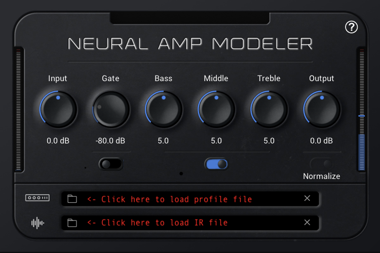

# Quick start

## Download and install plugin

Go to [Download](DOWNLOAD.md) and download the installer for NAM plugin.

Plugin works with Windows and MacOS. 

There's a fork that works as LV2 plugin available: [github.com/mikeoliphant/neural-amp-modeler-lv2](https://github.com/mikeoliphant/neural-amp-modeler-lv2).

## Open plugin

Open plugin as a VST or AU in your DAW of choice, or open the standalone app.

## Download already trained profiles or create your own

If you want to download already trained profiles, go to: [Profile sharing](MODELS.md).
You can train your own files if you need, please go to: [How to create profiles](TRAIN.md).

## Load profile

Load the profile file (and IR if needed).

