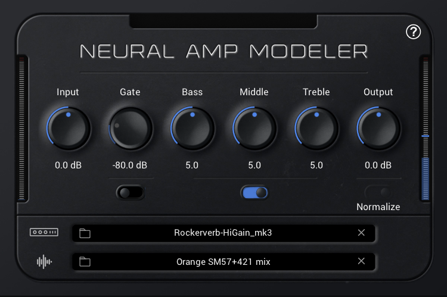

# Neural Amp Modeler (NAM)

A VST3/AudioUnit plug-in* for Neural Amp Modeler, built with iPlug2.

* [youtube.com/user/RunawayThumbtack](https://www.youtube.com/user/RunawayThumbtack)
* [github.com/sdatkinson/neural-amp-modeler](https://github.com/sdatkinson/neural-amp-modeler)

To download the plugin, go to [Download](DOWNLOAD.md) section.
